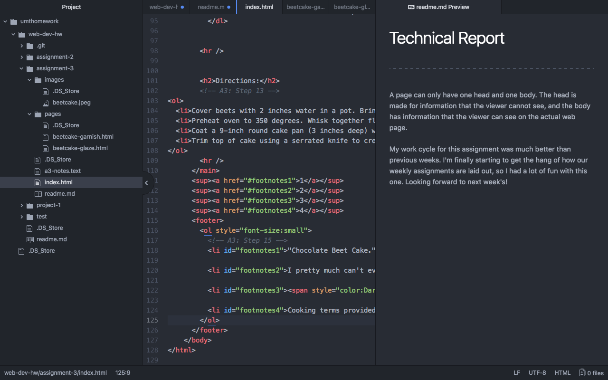

# Technical Report
---
A page can only have one head and one body. The head is made for information that the viewer cannot see, and the body has information that the viewer can see on the actual web page.

My work cycle for this assignment was much better than previous weeks. I'm finally starting to get the hang of how our weekly assignments are laid out, so I had a lot of fun with this one. Looking forward to next week's!

