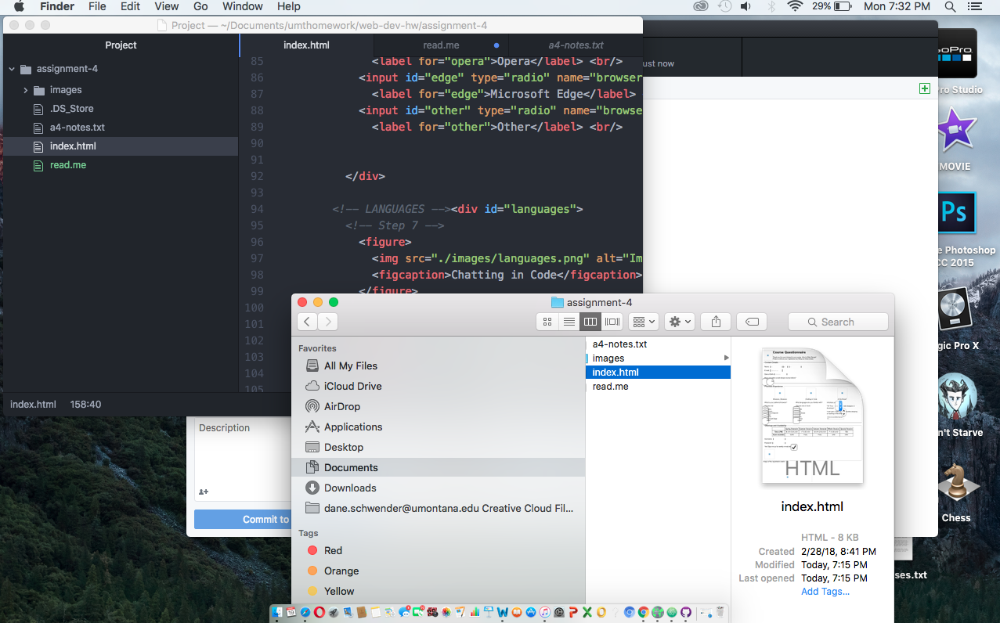

# Assignment 4

Alt text is a word or phrase that is used to provide a description to an image. We use it so that web viewers can have a better understanding of the meaning of an image.

I come across forms on the internet all of the time. The most recent form I had to complete online was one for ultimate frisbee. It is basically meant to be an exchange of information between a business/organization and an individual.

I had a good time editing this form, because I can immediately see how this could apply to my career in the future. It took me some time to get it finished, but I kept on going an eventually I made it out alive. Looking forward to next week's assignment.

