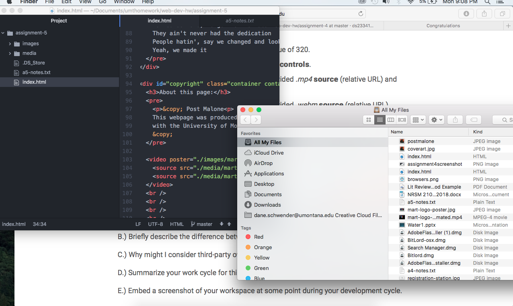

# Assignment 5

An Id is something completely unique on a website. Class is a way of grouping similar pieces on a website together. Div offers a block level element that allows you to group other elements together. Span organizes groups together that might require extra styling.

Third party media is better because it is more reliable and works at a faster rate.

My work cycle for this assignment for this assignment was rather slow for me, because I hard time remembering some of the concepts in previous classes. I eventually found my groove, and ended up having a lot of fun with it. I am a musician, so I found this assignment particularly interesting.

