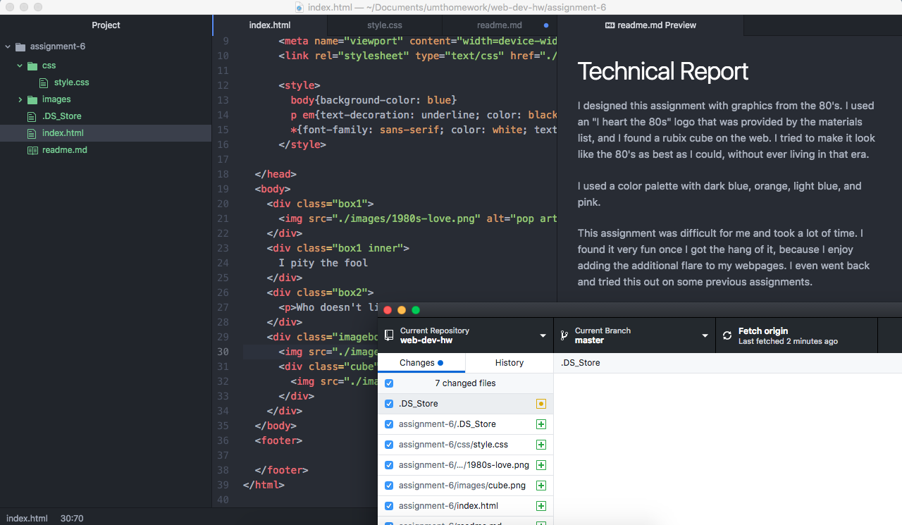

# Technical Report

I designed this assignment with graphics from the 80's. I used an "I heart the 80s" logo that was provided by the materials list, and I found a rubix cube on the web. I tried to make it look like the 80's as best as I could, without ever living in that era.

I used a color palette with dark blue, orange, light blue, and pink.

This assignment was difficult for me and took a lot of time. I found it very fun once I got the hang of it, because I enjoy adding the additional flare to my webpages. I even went back and tried this out on some previous assignments.

