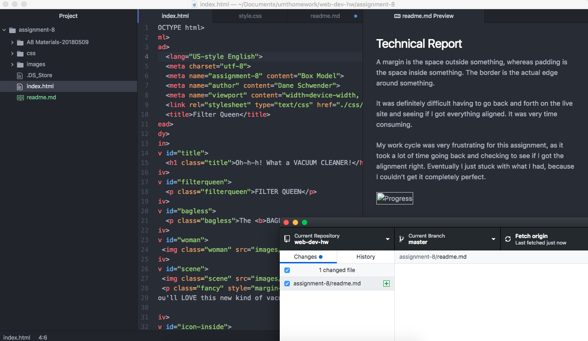

## Technical Report

A margin is the space outside something, whereas padding is the space inside something. The border is the actual edge around something.

It was definitely difficult having to go back and forth on the live site and seeing if I got everything aligned. It was very time consuming.

My work cycle was very frustrating for this assignment, as it took a lot of time going back and checking to see if I got the alignment right. Eventually I just stuck with what I had, because I couldn't get it completely perfect.

