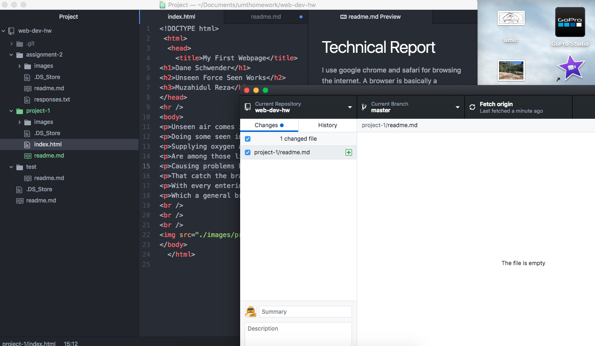

# Technical Report
I use google chrome and safari for browsing the internet. A browser is basically a gateway to the internet that allows you access webpages on your computer.

The Wayback Machine was a very interesting tool that I had no idea even exsisted. It was very cool to see the evolution of certain websites. I looked up google and noticed how plain it used to be. They are constantly updating google with art now, so it was interesting to see the dramatic difference.

I had some difficulty figuring out how to properly close things in HTML, but I was able to get the hang of it rather quickly. Another thing I had trouble with was remembering how and when to put a slash on the closing code.

