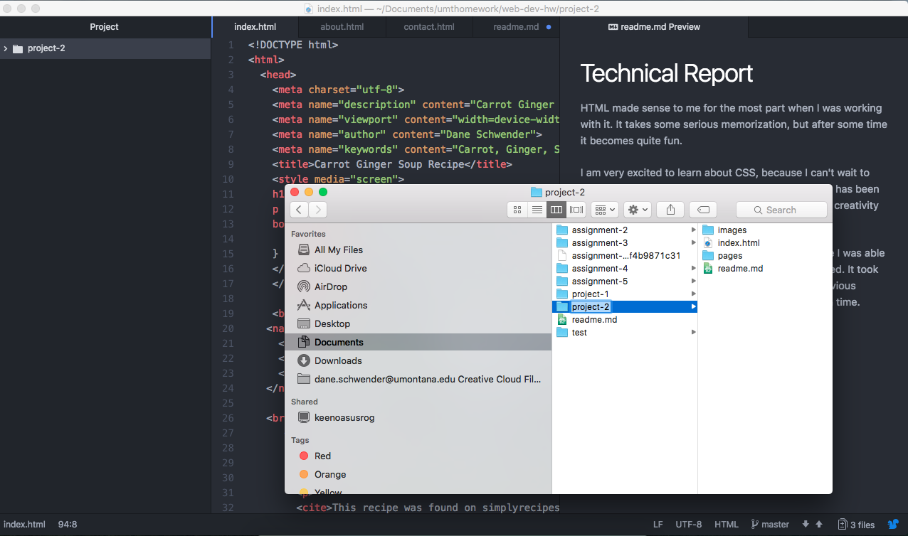

# Technical Report
HTML made sense to me for the most part when I was working with it. It takes some serious memorization, but after some time it becomes quite fun.

I am very excited to learn about CSS, because I can't wait to really make my webpages turn alive. So far the class has been mostly about structure, so I am excited to add some creativity to the mix.

This project took me some extra time to do, because I was able to customize pretty much everything the way I wanted. It took me some time remembering what I learned from previous lessons, but eventually got it done and submitted on time.

